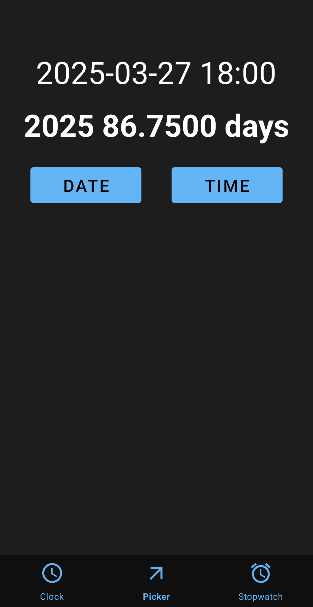

# Decimal Clock

A demonstrator application that showcases an innovative timekeeping system rooted in the decimal number system. This app transforms traditional date and time into a decimal format, where whole numbers signify the total number of days since the new year, and decimal values indicate the fraction of the day elapsed.

## Features

- **Current Time Conversion**: Convert current time and date to decimal format
- **Calendar-based Conversion**: Select any date and time to see its decimal representation
- **Decimal Stopwatch**: Measure time intervals using decimal day units with SI prefixes

  

## About the Time System

This alternative time system offers theoretical advantages over traditional time measurements:

- Based purely on decimal number system, avoiding mixed units like hours (24), minutes (60), and seconds (60)
- Flexible precision through decimal places
- Follows SI unit prefix conventions
- Simpler mathematical operations with time values

While impractical for everyday use (since no one uses this time system), it demonstrates an interesting alternative to conventional time measurement.

## Technical Details

- **Minimum SDK**: Android 8.0 Oreo (API 26)
- **Target SDK**: Android 15.0 VanillaIceCream (API 35)
- **Programming Language**: Kotlin
- **UI Implementation**: XML layouts
- **Screen Support**: Currently only tested on 1080x2400 resolution
- **Privacy Friendly**:No data collection and no internet connection required

## Installation

Download the latest .apk file from the [Releases](../../releases) section and install it directly on your Android device

## Limitations

- Basic UI design
- Limited screen resolution testing
- No practical use case

